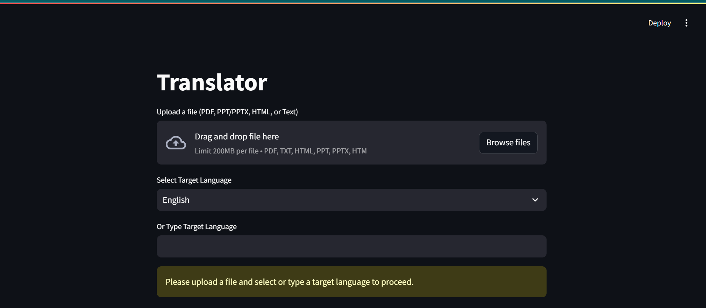

# Multilingual-Content-Translation-API (PDF, PPT, TXT, HTML)

## Overview
This project provides a file translation service that translates text content from various file types (PDF, PPT/PPTX, TXT, HTML) into different languages. The system consists of a **Streamlit** frontend for user interaction and a **FastAPI** backend for processing file uploads, text extraction, and translations using the OpenAI API.

### Features
- **File Upload**: Supports uploading files of types PDF, PPT/PPTX, TXT, and HTML.
- **Language Selection**: Users can select a target language from a predefined list or type a custom language.
- **Text Extraction**: Automatically extracts text from uploaded files using libraries like `PyPDF2`, `python-pptx`, and `BeautifulSoup`.
- **Translation**: Uses OpenAI's GPT model to translate extracted text into the target language.
- **Real-time Output**: Displays translated text in the Streamlit interface.
- **Modular Structure**: Organized into a frontend (`app.py`) and backend (`backend/` directory) for scalability and maintainability.



## Tech Stack
- **Streamlit**: Frontend for user interaction.
- **FastAPI**: Backend for handling file uploads, text extraction, and translations.
- **OpenAI API (GPT-3/4)**: For translating text.
- **LangChain**: For chaining language models (optional, used for advanced processing).
- **BeautifulSoup**: For parsing HTML files and extracting text.
- **python-pptx**: For handling PPT/PPTX files.
- **PyPDF2**: For reading and extracting text from PDF files.
- **python-multipart**: For handling form data in FastAPI.

## Requirements

### Software Requirements
- **Python 3.7 or higher**
- `pip` for installing required libraries.

### Directory Structure
```
project_directory/
├── app.py                     # Streamlit frontend
├── backend/
│   ├── __init__.py           # Empty file to make backend a package
│   ├── main.py              # FastAPI backend entry point
│   ├── services/
│   │   ├── __init__.py      # Empty file
│   │   └── translation_service.py  # Translation logic
│   ├── utils/
│   │   ├── __init__.py      # Empty file
│   │   ├── text_extraction.py  # Text extraction utilities
│   │   └── language_map.py    # Language mapping
├── requirements.txt           # Dependencies
├── .env                      # Environment variables (not tracked in git)
└── README.md                 # Project documentation
```

### Install the Dependencies
Install the required libraries using the provided `requirements.txt`:
```bash
pip install -r requirements.txt
```

The `requirements.txt` file contains:
```
streamlit
fastapi
openai
requests
python-pptx
beautifulsoup4
langchain
pypdf2
uvicorn
python-dotenv
python-multipart
```

### Environment Variables
Create a `.env` file in the root directory to store your OpenAI API key:
```
OPENAI_API_KEY=your_openai_api_key_here
```
You can obtain an API key from [OpenAI's API page](https://platform.openai.com/account/api-keys).

## Running the Project

### 1. Start the FastAPI Backend
Run the FastAPI server to handle file processing and translations:
```bash
uvicorn backend.main:app --reload
```
- The FastAPI server will run at `http://127.0.0.1:8000`.
- You can access the Swagger UI at `http://127.0.0.1:8000/docs` to test the `/translate-file/` endpoint directly.

### 2. Start the Streamlit Frontend
Run the Streamlit frontend to interact with the application:
```bash
streamlit run app.py
```
- The Streamlit app will open in your browser at `http://localhost:8501`.

### 3. Upload and Translate
1. Open the Streamlit app (`http://localhost:8501`).
2. Upload a file (PDF, PPT, TXT, or HTML).
3. Select a target language from the dropdown or type a custom language.
4. Click the **Translate** button to process the file and display the translated text.

### 4. Error Handling and Logs
- If there are errors (e.g., file processing or translation failures), the app will display an error message in the Streamlit UI.
- Check the terminal logs for both FastAPI and Streamlit for detailed debugging information.

## File Text Extraction Logic
- **PDF**: Uses `PyPDF2` to extract text from PDF files.
- **PPT/PPTX**: Uses `python-pptx` to extract text from PPT files.
- **HTML**: Uses `BeautifulSoup` to parse HTML and extract text.
- **TXT**: Uses simple file reading and decoding for TXT files.

## How It Works
1. **File Upload**: The user uploads a file via the Streamlit interface.
2. **Text Extraction**: The FastAPI backend processes the file and extracts the text using appropriate libraries.
3. **Translation**: The extracted text is sent to OpenAI's GPT API for translation into the target language.
4. **Displaying Result**: The translated text is returned to the Streamlit frontend and displayed to the user.

## Example Use Cases
- **Educational Content**: Translate textbooks, academic papers, or presentations into multiple languages.
- **Business Documents**: Translate reports, proposals, or documents for international teams.
- **Legal Documents**: Translate legal documents for cross-border communication.

## Possible Enhancements
- **Multiple File Support**: Allow users to upload and translate multiple files at once.
- **Language Detection**: Automatically detect the source language of the file and translate it into the selected target language.
- **Batch Processing**: Add support for batch translation of files.
- **Custom Translation Models**: Integrate additional translation APIs or models for improved accuracy.

## Troubleshooting
If you encounter issues:
1. **FastAPI Backend Not Responding**:
   - Ensure the FastAPI server is running (`uvicorn backend.main:app --reload`).
   - Check the terminal logs for errors.
   - Test the `/translate-file/` endpoint in the Swagger UI (`http://127.0.0.1:8000/docs`).
2. **Streamlit Frontend Errors**:
   - Ensure the FastAPI backend is running before starting Streamlit.
   - Check the Streamlit terminal logs for errors.
   - Verify the `target_language` is not empty when clicking "Translate".
3. **Translation Errors**:
   - Ensure your OpenAI API key is valid and has sufficient credits.
   - Check the FastAPI logs for detailed error messages from the OpenAI API.

## Optional: Pushing to GitHub
If you want to host this project on GitHub or share it with others, follow these steps to push the code to a GitHub repository:

1. **Initialize a Git Repository**:
   ```bash
   git init
   ```
2. **Create a `.gitignore` File**:
   Add the following to a `.gitignore` file to exclude sensitive or unnecessary files:
   ```
   .env
   __pycache__/
   *.pyc
   ```
3. **Add and Commit Files**:
   ```bash
   git add .
   git commit -m "Initial commit with modular structure"
   ```
4. **Create a Repository on GitHub**:
   - Go to GitHub and create a new repository (e.g., `file-translation-service`).
   - Do not initialize it with a README or other files if you’re pushing an existing project.
5. **Push to GitHub**:
   ```bash
   git remote add origin <your-repo-url>
   git branch -M main
   git push -u origin main
   ```

## Conclusion
This project provides an end-to-end file translation system using AI-powered translation (OpenAI GPT) and supports multiple file formats. The modular structure separates the frontend (Streamlit) and backend (FastAPI), making it easy to maintain and extend. It leverages powerful libraries for text extraction (`BeautifulSoup`, `python-pptx`, `PyPDF2`) and provides an efficient translation experience for users.
